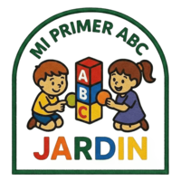

# 🏫 Mi Primer ABC — Sistema de Control Escolar

Sistema web responsivo para la gestión administrativa del Jardín de Niños **Mi Primer ABC**.

---

## 🗂️ Estructura del Proyecto

```
miprimerabc/
│
├── index.html                  ← Página de login
│
├── pages/
│   ├── dashboard.html          ← Panel principal (Fase 0 ✅)
│   ├── alumnos.html            ← Módulo de alumnos (Fase ✅)
│   ├── pagos.html              ← Pagos del alumno (Fase 3 y 4 ✅)
│   ├── colegiaturas.html       ← Colegiaturas (Fase 5 ✅)
│   ├── ingresos-gastos.html    ← Dashboard financiero (Fase 6)
│   └── configuracion.html      ← Catálogo de precios (Fase ✅)
│
├── css/
│   ├── design-system.css       ← Variables, colores, tipografía ✅
│   ├── components.css          ← Botones, cards, forms, modales ✅
│   └── layout.css              ← Sidebar, topbar, responsive ✅
│
├── js/
│   ├── supabase-config.js      ← Conexión a Supabase ✅
│   └── auth.js                 ← Login / sesión / logout ✅
│
├── assets/
│   └── img/
│       └── logo.png
│
└── database-schema.sql         ← Esquema completo de BD ✅
```

---

## 🚀 Configuración Inicial

### 1. Crear proyecto en Supabase

1. Ve a [https://supabase.com](https://supabase.com) y crea una cuenta gratuita
2. Crea un nuevo proyecto
3. Anota tu **Project URL** y tu **anon/public key** (en Project Settings → API)

### 2. Configurar las credenciales

Edita el archivo `js/supabase-config.js` y reemplaza:

```js
const SUPABASE_URL = "https://XXXXXX.supabase.co";
const SUPABASE_ANON_KEY = "eyJ...tu_clave...";
```

### 3. Crear el esquema de base de datos

1. En tu proyecto de Supabase → **SQL Editor** → **New Query**
2. Pega el contenido de `database-schema.sql`
3. Ejecuta con **Run**

### 4. Crear el usuario de la directora

En Supabase → **Authentication** → **Users** → **Add User**:

- Email: `directora@miprimerabc.mx` (o el que prefieras)
- Password: contraseña segura

### 5. Subir el logo

Coloca el logo del kínder en `assets/img/logo.png` (PNG con fondo transparente, mínimo 200×200px).

Descomenta la línea del `` en el login y el sidebar:

```html

```

### 6. Deploy en Netlify

1. Sube el proyecto a un repositorio de GitHub
2. En [netlify.com](https://netlify.com) → **Add new site** → **Import from Git**
3. Selecciona el repositorio
4. Build command: (vacío)
5. Publish directory: `.` (raíz)
6. Deploy 🚀

---

## 🎨 Sistema de Diseño

### Colores principales

| Variable          | Color              | Uso                    |
| ----------------- | ------------------ | ---------------------- |
| `--color-primary` | `#2E9E5B` Verde    | Botones, links activos |
| `--color-pink`    | `#F06B8A` Rosa     | Alertas, estados       |
| `--color-yellow`  | `#F5C842` Amarillo | Pendientes             |

### Colores por grado

| Variable           | Color                | Grado    |
| ------------------ | -------------------- | -------- |
| `--color-maternal` | `#64B5F6` Azul cielo | Maternal |
| `--color-kinder1`  | `#F5C842` Amarillo   | Kínder 1 |
| `--color-kinder2`  | `#EF5350` Rojo       | Kínder 2 |
| `--color-kinder3`  | `#2E9E5B` Verde      | Kínder 3 |

### Tipografía

- **Headings:** Quicksand (bold)
- **Body:** Nunito

---

## 📋 Plan de Fases

| Fase | Módulo                                              | Estado       |
| ---- | --------------------------------------------------- | ------------ |
| 0    | Setup, diseño base, login, dashboard shell          | ✅ Completo  |
| 1    | Catálogo de precios (Nuevo Ingreso / Reinscripción) | ✅ Completo  |
| 2    | Módulo de alumnos (CRUD + foto)                     | ✅ Completo  |
| 3    | Pagos: Inscripción, Material, Libros, Manuales      | ✅ Completo  |
| 4    | Pedidos de Uniforme y Bata                          | ✅ Completo  |
| 5    | Módulo de Colegiaturas                              | ✅ Completo  |
| 6    | Dashboard de Ingresos y Gastos                      | ⏳ Pendiente |
| 7    | QA, ajustes finales y deploy                        | ⏳ Pendiente |

---

## 🛠️ Stack Tecnológico

- **Frontend:** HTML5 + CSS3 + JavaScript Vanilla (ES6+)
- **Base de datos:** Supabase (PostgreSQL)
- **Auth:** Supabase Auth (email + contraseña)
- **Storage:** Supabase Storage (fotos de alumnos)
- **Hosting:** Netlify

---

_Mi Primer ABC — Sistema de Control Escolar © 2025_
